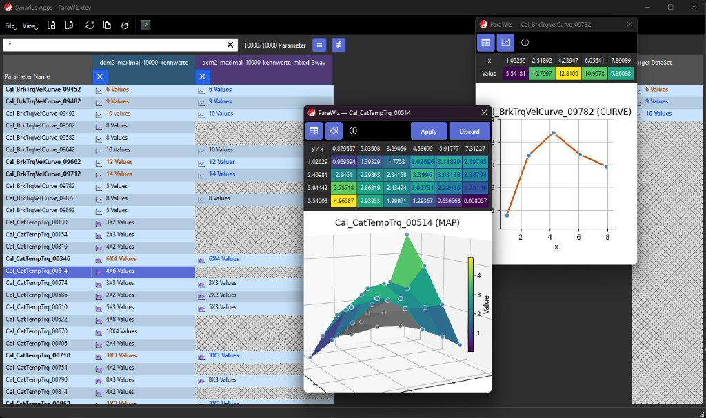

# Synarius Apps


**synarius-apps** bundles the **Synarius DataViewer** (MDI desktop app for inspecting time-series and measurements), **Synarius ParaWiz** (desktop app for comparing and editing calibration parameters across datasets), and shared Qt UI pieces under **`synariustools`**, especially the reusable scope/legend plot widget. It depends on **[synarius-core](https://github.com/synarius-project/synarius-core)**.

| | |
|--|--|
| **Repository** | [synarius-project/synarius-apps](https://github.com/synarius-project/synarius-apps) |
| **PyPI-style name** | `synarius-apps` (see `pyproject.toml`) |

**Contributing:** follow the **[Synarius programming guidelines](https://synarius-project.github.io/synarius-guidelines/programming_guidelines.html)** (HTML) and this repository’s **[CONTRIBUTING.md](CONTRIBUTING.md)**.

**Note (Windows checkout):** If a junction `synarius-apps` still points at a folder named `synarius-dataviewer`, that layout is fine. To rename the directory in place: close tools using it, remove only the junction (`rmdir synarius-apps`), then rename the real folder to `synarius-apps`.

## Synarius DataViewer


The **Synarius DataViewer** is a PySide6 application for exploring **multi-channel time-series**: an **oscilloscope-style plot** (zoom, pan, rubber-band zoom, optional walking time window), a **legend** with per-channel visibility, live values, and optional **A/B cursors**, plus **drag-and-drop** (or programmatic) channel loading. The same plot stack is used when **Synarius Studio** opens a live viewer for a diagram **DataViewer** block. Implementation lives in `src/synarius_dataviewer/` and `src/synariustools/tools/plotwidget/`; run it with the console entry point **`synarius-dataviewer`**.

## Synarius ParaWiz



**Synarius ParaWiz** is a PySide6 **parameter-workbench** built on the same **synarius-core** model and **Controller Command Protocol (CCP)** as Synarius Studio. Typical workflow:

- **Load and compare** two or more **parameter datasets** (e.g. DCM-based) in a single **table**: one row per calibration name, one column per dataset, with optional **filters** (name search, hide equal / show only differing rows).
- **Visual diff**: cell styling and icons highlight **scalar vs. curve vs. map** parameters and cross-dataset differences.
- **Deep inspection**: double-click opens dedicated editors for **CURVE** (tabular breakpoints + 2D plot) and **MAP** (value matrix, axis labels, **3D surface** preview). Edits follow the same rules as the rest of the Synarius toolchain (repository-backed parameters).
- **Scratch target**: copy selected parameters into a dedicated **`parawiz_target`** dataset for staging changes without overwriting comparison files.
- **Console**: optional **CLI / CCP** integration for scripting (`select`, `cp`, dataset registration, …).

Implementation lives in `src/synarius_parawiz/`; run it with **`synarius-parawiz`**.

## Install (development)

**Python 3.11.x** is required (see `requires-python` in `pyproject.toml`).

**CI / clones** resolve `synarius-core` via the Git URL pinned in `pyproject.toml`. Measurement file I/O is implemented in **synarius-core** (`synarius_core.io`); this package still declares `pandas` / `pyarrow` / `asammdf` / `numpy` so installers resolve one consistent stack.

```bash
pip install -e .
```

**Local monorepo** (sibling checkout of `synarius-core`):

```bash
cd ../synarius-core && pip install -e ".[timeseries]"
cd ../synarius-apps && pip install -e .
```

If `pip` reports a conflict between the pinned Git revision of `synarius-core` and your local editable core, install the app with `pip install -e . --no-deps` after `pip install -e "../synarius-core[timeseries]"`, then add missing deps manually.

Console entry point (name kept for compatibility):

```bash
synarius-dataviewer
```

ParaWiz entry point:

```bash
synarius-parawiz
```

## Branches and automation

| Branch | Workflows |
|--------|-----------|
| `main` | **CI** — Ruff + pytest |
| `dev`  | **Docs** — Sphinx build, deploy to GitHub Pages (repository settings must enable Pages from “GitHub Actions”) |
| Tag `vX.Y.Z` | **Release** — sdist/wheel artifact job, Windows PyInstaller `.exe`, WiX **MSI**, GitHub Release with the MSI (same layout as `synarius-studio`) |

Create a release (example):

```bash
git tag v0.0.1
git push origin v0.0.1
```

## Layout

- `src/synarius_dataviewer/` — Dataviewer application package (console script `synarius-dataviewer`)
- `src/synarius_parawiz/` — ParaWiz application package (console script `synarius-parawiz`)
- `src/synariustools/tools/plotwidget/` — reusable Qt plot widget (`DataViewerWidget`, `create_data_viewer`, …)
- `docs/` — Sphinx + sphinx-needs + zerovm theme
- `synarius_dataviewer.spec` — PyInstaller one-file spec for the Windows installer job
- `DISCLAIMER.txt` — license text shown in the MSI

### Plot widget (embedded use)

```python
from synariustools.tools.plotwidget import create_data_viewer, PlotViewerMode

# embedded=True: toolbar + widget in a small host (default, same idea as the MDI child)
viewer = create_data_viewer(my_callable_or_data_source, parent=None, embedded=True)

# Static mode with legend hidden at startup:
viewer = create_data_viewer(
    my_callable_or_data_source,
    mode=PlotViewerMode.static(legend_visible_by_default=False),
)
```

Imports from `synarius_dataviewer.widgets.data_viewer` remain valid shims to the same implementation.

## Docs (local)

```bash
pip install -e ".[docs]"
sphinx-build -b html docs docs/_build/html
```
